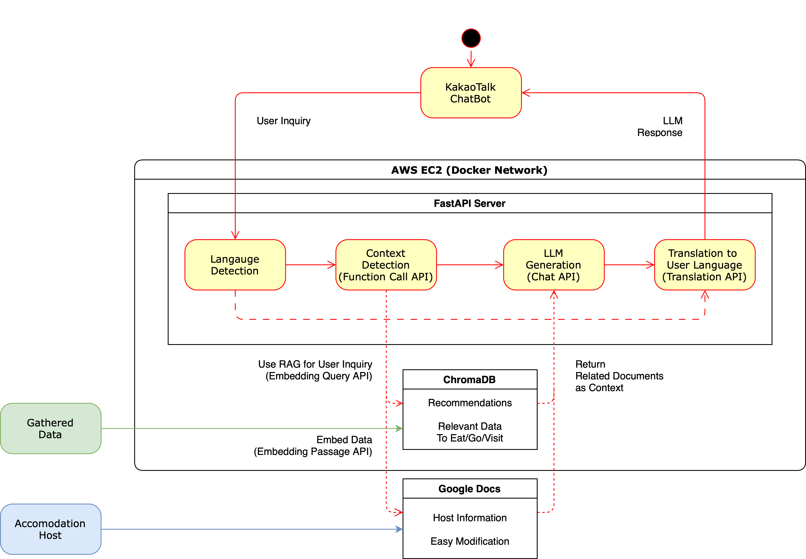

# Chat JEJU

[English](README.md) | [한국어](README.ko.md)

## 프로젝트 개요

- 제주도에는 아직 많은 이들에게 알려지지 않은 매력적인 숙소와 지역 사업체들이 숨겨져 있습니다. 저희는 혁신적인 기술을 통해 매력적이지만 잘 알려지지 않은 장소를 여행객들과 연결하고자 합니다.
- 이 프로젝트는 단순한 편의 제공을 넘어서 지역 경제 성장에 기여하는 것을 목표로 하고 있습니다. 'Chat JEJU'를 통해 덜 알려진 지역 사업체들을 조명하여, 지역 사업가들에게 새로운 기회를 제공하고 관광
  수익을 지역 전반에 고르게 분배하고자 합니다. 이를 통해 지역 경제를 활성화하고, 인기 관광지에 몰리는 방문객들을 분산시켜 다양한 장소에서 지속 가능한 관광이 이루어지도록 기여하고 싶습니다. 또한, 다국어 지원을
  통해 외국인 관광객들의 접근성을 높여 제주도 여행 경험을 더욱 향상시키고자 합니다. 24시간 이용 가능한 서비스 역시 고객 만족도를 크게 높일 수 있을 것입니다.

## Demo Video


## Flow Chart



## 준비

Google Docs API를 사용하기 위한 서비스 계정 키 파일 발급:

1. Google Cloud Console에 로그인합니다.
2. 프로젝트 선택 메뉴에서 "새 프로젝트"를 선택하고 새 프로젝트를 만듭니다.
3. 왼쪽 메뉴에서 "API 및 서비스" > "라이브러리"로 이동하여 Google Docs API와 Google Drive API를 모두 검색하고 활성화합니다.
4. 왼쪽 메뉴에서 "API 및 서비스" > "사용자 인증 정보"로 이동하여 "사용자 인증 정보 만들기" 버튼을 클릭하고 "서비스 계정"을 선택합니다.
5. "키 만들기"를 클릭하고 "JSON" 키 유형을 선택합니다. <- 이것이 서비스 계정 키입니다.
6. Google Drive에서 API를 통해 액세스하려는 문서를 열고 공유 설정에 서비스 계정 이메일 주소를 추가합니다.

## 시작하기

프로젝트를 확인하려면:

```
git clone https://github.com/Git-Push-Gang/proxy.git
```

> [!IMPORTANT]
> Upstage API 키를 지정해야 합니다. `/srcs`에 `.env`를 만들고 `API_KEY="up....."`를 지정하세요.

> [!IMPORTANT]
> `/srcs/solar-backend-fastapi/app/data`에 `.service-account.json`을 생성하세요.
> 이는 [준비] 섹션에서 생성한 Google Cloud 서비스 계정 JSON 파일입니다.

> [!NOTE]
> 도커 서비스를 실행하기 전에 `docker-compose.yml`에서 `driver_opts`를 주석 처리하세요.

도커 서비스를 실행하려면:

```
make
```

## 사용법

임베딩 컬렉션을 초기화하려면 다음 명령을 실행하세요:

```
python srcs/solar-backend-fastapi/app/data/init_embedding.py
```

`Chat JEJU` 챗봇에 질문하고 답변을 받으려면:

- 숙소에 대한 최신 정보를 얻으려면 요청 본문의 `utterance` 필드에 `{숙소_이름}`을 포함하세요.
    - 예: `'바띠에의 Wi-Fi 정보를 알려주실 수 있나요?'`
- 특정 지역에 대한 정보를 얻으려면 요청 본문의 `utterance` 필드에 `{지역_이름}`을 포함하세요.
    - 예: `'동카름에 있는 아늑한 카페를 추천해주실 수 있나요?'`

```
curl -X POST --location "http://localhost/api/v1/chat/kakao?client_name=solar" \
    -H "accept: application/json" \
    -H "Content-Type: application/json" \
    -d '{
          "intent": {
            "id": "es2mb937ado5bmj04dkzmogn",
            "name": "블록 이름"
          },
          "userRequest": {
            "timezone": "Asia/Seoul",
            "params": {
              "ignoreMe": "true"
            },
            "block": {
              "id": "es2mb937ado5bmj04dkzmogn",
              "name": "블록 이름"
            },
            "utterance": "Can you tell me the Wi-Fi information for Battie?",
            "lang": null,
            "user": {
              "id": "945412",
              "type": "accountId",
              "properties": {}
            }
          },
          "bot": {
            "id": "your_bot_id",
            "name": "봇 이름"
          },
          "action": {
            "name": "your_action_name",
            "clientExtra": null,
            "params": {
            },
            "id": "your_action_id",
            "detailParams": {}
          }
        }'
```

chroma db에서 임베딩 컬렉션을 검색하려면:

```
curl -X GET --location "http://localhost/api/v1/db/collections" \
    -H "Accept: application/json"
```

> [!NOTE]
> 발표 자료를 원하실 경우, 압축된 pdf 파일을 다운로드 받아주세요 (영상은 용량 문제로 제거하였습니다.)
> [PDF file](resources/chat_jeju_presentation.compressed.pdf)
